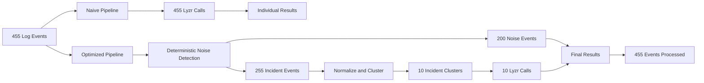

# Lyzr AI Engineer Assessment – Track A
## Log Auto-Remediation

**Submitted by:** Manoj Kumar Sambana

This repository contains my solution for the Lyzr AI Engineer Assessment, Track A.

The task is to process a dataset of infrastructure and application log events and determine which events are real incidents, identify the root cause, and select an approved remediation without inventing actions outside the allowed remediation set.

The dataset contains **455 log events**.

My main focus was to compare a simple naive approach against an optimized approach that reduces unnecessary Lyzr agent calls while still processing the complete dataset.

---

# The Problem

A straightforward approach would be to send every one of the 455 log events to the Lyzr agent.

That works, but it creates unnecessary work because:

- Some events are deterministic noise and do not need AI reasoning.
- Many incident events are repeated versions of the same underlying problem.
- Repeated LLM calls increase cost and processing overhead.
- The remediation must come from a fixed approved set.

The system therefore needs to answer the following for each real incident:

1. Is this a real actionable incident?
2. What category does it belong to?
3. What is the root cause?
4. What approved remediation should be selected?

The goal is not just to classify logs correctly, but to do it efficiently without losing control over the remediation output.

---

# Solution Overview

I built and compared two approaches:

## Naive Baseline

The naive approach sends every log event individually to the Lyzr agent.

```text
455 Log Events
      |
      v
455 Lyzr Agent Calls
      |
      v
455 Individual Classifications
```

This gives a simple baseline for measuring the effect of optimization.

---

## Optimized Pipeline

The optimized pipeline performs cheap deterministic processing before calling the Lyzr agent.

```text
                           455 LOG EVENTS
                                  |
                                  v
                       Load Input Dataset
                                  |
                                  v
                    Deterministic Noise Detection
                                  |
                   +--------------+--------------+
                   |                             |
                   v                             v
            200 Noise Events              255 Incident Events
            No LLM/API Call                      |
                   |                             v
                   |                  Normalize Messages
                   |                             |
                   |                             v
                   |                    Group Similar Events
                   |                             |
                   |                             v
                   |                       10 Clusters
                   |                             |
                   |                             v
                   |                    10 Lyzr Agent Calls
                   |                             |
                   +-------------+---------------+
                                 |
                                 v
                       Validate Agent Response
                                 |
                                 v
                     Apply Result Back to Events
                                 |
                                 v
                      FINAL RESULTS FOR 455 EVENTS
```

The optimized approach does not skip repeated events.

Instead, repeated incident patterns are grouped together. One representative event from each group is sent to the Lyzr agent, and the returned classification is applied to the other events belonging to the same group.

This is how the system reduces the number of expensive AI calls while still accounting for the full dataset.

---

# Naive vs Optimized Design



---

# How the Optimization Works

The main optimization is based on a simple idea:

> Do not use an LLM for work that can safely be handled using deterministic logic, and do not repeat LLM reasoning for the same incident pattern.

The optimized pipeline works in the following order:

### Step 1 – Load the dataset

The harness loads all **455 log events**.

### Step 2 – Detect deterministic noise

Known non-actionable patterns are detected using local Python logic.

These events do not require an LLM or Lyzr agent call.

In the final optimized run:

```text
200 events were handled as deterministic noise
```

### Step 3 – Normalize incident messages

Repeated incidents can contain changing values such as:

- Duration
- Request count
- Port numbers
- IDs
- Numeric values

For example:

```text
Connection timeout to Postgres after 30 seconds

Connection timeout to Postgres after 45 seconds

Connection timeout to Postgres after 60 seconds
```

These are different raw messages, but they describe the same incident pattern.

The harness normalizes the variable parts before grouping.

### Step 4 – Group repeated incident patterns

The remaining incident events are grouped into clusters.

In the final optimized benchmark:

```text
255 incident events
        |
        v
10 representative incident clusters
```

### Step 5 – Call the Lyzr agent

Instead of calling the agent once for every event, the optimized pipeline sends one representative incident from each cluster.

```text
Naive:      455 Lyzr calls

Optimized:   10 Lyzr calls
```

### Step 6 – Validate the response

The returned result is checked against the expected output contract and approved taxonomy.

### Step 7 – Fan the result back out

The classification from the representative incident is applied to the events belonging to that cluster.

The final output still accounts for all **455 events**.

---

# LLM Call Reduction

```text
NAIVE PIPELINE

455 Events
██████████████████████████████████████████████████
455 Lyzr Calls


OPTIMIZED PIPELINE

10 Clusters
█
10 Lyzr Calls
```

| Metric | Naive | Optimized |
|---|---:|---:|
| Total events processed | 455 | 455 |
| Lyzr agent calls | 455 | 10 |
| Calls avoided | - | 445 |
| Call reduction | - | 97.8% |

The optimization reduces the amount of AI work without reducing dataset coverage.

---

# What the Lyzr Agent Does

The Python harness handles deterministic processing and optimization.

The Lyzr agent handles the actual incident classification.

For a real incident, the agent determines:

- Whether the event is an actionable incident
- Incident category
- Root cause
- Approved remediation
- Confidence

The agent returns structured output similar to:

```json
{
  "is_incident": true,
  "category": "capacity",
  "root_cause": "rate_limit_breach",
  "remediation": "add_backpressure_and_request_quota_increase",
  "confidence": 0.99
}
```

The remediation is restricted to the approved remediation set.

The goal is to prevent fabricated or arbitrary remediation actions.

---

# Example

Consider this event:

```text
service=search-api
severity=ERROR
message="rate limit exceeded: 429 from search-index, 12k req/min > 10k quota"
```

The agent classifies it as:

```json
{
  "is_incident": true,
  "category": "capacity",
  "root_cause": "rate_limit_breach",
  "remediation": "add_backpressure_and_request_quota_increase",
  "confidence": 0.99
}
```

If multiple events represent the same rate-limit incident pattern, the optimized pipeline works like this:

```text
Repeated Rate Limit Events
             |
             v
        One Cluster
             |
             v
One Representative Lyzr Call
             |
             v
      Classification Result
             |
             v
Applied to All Events in the Cluster
```

---

# Classification and Remediation Control

During testing, I found that providing the model with three completely independent lists for:

- Category
- Root cause
- Remediation

could allow the model to produce combinations that were individually valid but not correctly related.

For example, the root cause could be correct while the category was selected independently.

To address this, I changed the agent instructions to explicitly define the relationship between the classification values.

For example:

```text
memory_leak -> resource_exhaustion

rate_limit_breach -> capacity

db_connection_pool_exhausted -> dependency_failure

db_deadlock -> code_defect

upstream_outage -> dependency_failure

null_pointer -> code_defect

disk_full -> resource_exhaustion

missing_index -> performance

consumer_lag -> capacity

expired_cert -> config_error
```

The agent instructions were updated and tested through both the Lyzr Playground and the Python harness.

This ensured that category selection followed the expected mapping for the identified root cause.

---

# Results

The benchmark was run against the complete **455-event dataset**.

The labeled portion of the dataset was used for the reported classification accuracy metrics.

| Metric | Result | Target |
|---|---:|---:|
| Category macro-F1 | 1.000 | >= 0.85 |
| Root-cause accuracy | 1.000 | >= 0.80 |
| Fabricated remediations | 0 | 0 |
| False escalations | 0 | 0 |
| Full dataset processed | 455 events | 455 events |
| LLM call reduction | 97.8% | Optimization objective |
| Cost reduction | 97.7% | >= 50% |
| Naive p95 latency | 3.91 seconds | <= 4.0 seconds |
| Optimized p95 latency | 4.29 seconds | <= 4.0 seconds |

---

# Naive vs Optimized Results

```text
+--------------------------------------------------------------+
|                    NAIVE VS OPTIMIZED                        |
+----------------------------+-------------+-------------------+
| Metric                     | Naive       | Optimized         |
+----------------------------+-------------+-------------------+
| Events Processed           | 455         | 455               |
| Lyzr Calls                 | 455         | 10                |
| Category Macro-F1          | 1.000       | 1.000             |
| Root Cause Accuracy        | 1.000       | 1.000             |
| Fabricated Remediations    | 0           | 0                 |
| False Escalations          | 0           | 0                 |
| p95 Latency                | 3.91 s      | 4.29 s            |
| Cost Reduction             | Baseline    | 97.7%             |
+----------------------------+-------------+-------------------+
```

---

# Latency Investigation

Latency was the main area where the optimized live run did not fully meet the stated target.

The final measured results were:

```text
Naive p95 latency:       3.91 seconds
Target:                  <= 4.00 seconds
Status:                  PASS


Optimized p95 latency:   4.29 seconds
Target:                  <= 4.00 seconds
Status:                  0.29 seconds above target
```

The naive run met the p95 latency target.

The optimized run achieved **4.29 seconds**, which is **0.29 seconds above the target**.

I have reported this measured value directly instead of rounding it or treating it as a pass.

While investigating the latency behavior, I tested several improvements, including:

- Different Lyzr agent configurations
- Different available models
- Shortening the agent instructions
- Removing unnecessary repeated prompt content
- Simplifying the classification instructions
- Changing the taxonomy from independent lists to explicit mappings
- Reducing duplicate taxonomy information sent from the Python harness
- Using structured output without unnecessary commentary
- Running smoke tests before larger runs
- Comparing Python-side timing with Lyzr-side timing

These changes improved the design and reduced unnecessary processing.

The optimized p95 latency was reduced during testing and reached **4.29 seconds** in the final measured result.

Further live experimentation stopped when the available Lyzr credits were exhausted.

Rather than claim an improvement that was not actually measured, I kept the final measured result in the documentation.

---

# Cost Optimization

The biggest improvement was reducing unnecessary Lyzr agent calls.

```text
NAIVE

455 Events
     |
     v
455 Lyzr Calls


OPTIMIZED

455 Events
     |
     +----------------------------+
     |                            |
     v                            v
200 Deterministic Noise      255 Incident Events
No Agent Call                      |
                                  v
                              10 Clusters
                                  |
                                  v
                             10 Lyzr Calls
```

The final optimized result achieved:

```text
97.7% cost reduction compared with the naive baseline
```

This exceeds the stated cost reduction target.

---

# What I Optimized

The final design was reached through iterative testing.

The main optimizations were:

1. Deterministic noise filtering
2. Message normalization
3. Grouping repeated incident patterns
4. Reducing repeated Lyzr agent calls
5. Using one representative event per cluster
6. Validating returned classifications
7. Restricting remediation to the approved set
8. Changing the taxonomy to explicit root-cause-to-category mappings
9. Simplifying the agent instructions
10. Removing unnecessary repeated prompt content
11. Using structured output
12. Testing different agent and model configurations during latency investigation

The optimization work focused on reducing unnecessary AI work while maintaining classification accuracy and remediation safety.

---

# Repository Structure

```text
lyzr_track_a_final_submission/
│
├── README.md
│
├── track_a_logs.csv
│
├── harness/
│   ├── main.py
│   ├── requirements.txt
│   ├── README.md
│   └── supporting Python files
│
└── docs/
    ├── Track_A_Results_and_Optimization.pdf
    ├── Lyzr_TrackA_ScopingMemo.pdf
    ├── lyzr_studio_build_guide.md
    ├── results_table.md
    ├── optimization_writeup.md
    └── moving_target.md
```

---

# Project Files

## `track_a_logs.csv`

The complete Track A dataset containing **455 log events**.

## `harness/`

Contains the Python benchmark harness.

The harness is responsible for:

- Loading the dataset
- Detecting deterministic noise
- Normalizing messages
- Grouping repeated incident patterns
- Calling the Lyzr agent
- Collecting responses
- Validating results
- Calculating benchmark metrics

## `docs/Track_A_Results_and_Optimization.pdf`

Contains:

- Filled-in results table
- Naive baseline results
- Optimized results
- Accuracy evaluation
- Cost comparison
- Latency measurements
- Optimization work
- Latency investigation
- Evaluation scope and limitations

## `docs/Lyzr_TrackA_ScopingMemo.pdf`

Contains the client-facing scoping memo.

## `docs/lyzr_studio_build_guide.md`

Documents the Lyzr agent setup, including:

- Agent role
- Agent instructions
- Classification taxonomy
- Output format
- Configuration choices

---

# How to Run

Clone the repository:

```powershell
git clone https://github.com/manojsambana443/lyzr-track-a-assessment.git
```

Move into the repository:

```powershell
cd lyzr-track-a-assessment
```

Move into the harness directory:

```powershell
cd harness
```

Create a virtual environment:

```powershell
python -m venv .venv
```

Activate it:

```powershell
.\.venv\Scripts\Activate.ps1
```

Install the dependencies:

```powershell
pip install -r requirements.txt
```

Set the required Lyzr environment variables:

```powershell
$env:LYZR_API_KEY="YOUR_API_KEY"
$env:LYZR_AGENT_ID="YOUR_AGENT_ID"
$env:LYZR_USER_ID="YOUR_USER_ID"
```

Run a smaller smoke test:

```powershell
python main.py --data ..\track_a_logs.csv --limit 20
```

Run against the complete dataset:

```powershell
python main.py --data ..\track_a_logs.csv
```

The credentials are intentionally not included in this repository.

---

# Lyzr Agent

The Python harness calls a live Lyzr agent for incident classification.

The agent is configured specifically for this assessment and returns structured incident information.

The complete agent setup is documented in:

```text
docs/lyzr_studio_build_guide.md
```

## Public Agent Link

**Lyzr Agent:** ADD YOUR PUBLIC AGENT LINK HERE

---

# Demo

The demo shows the complete flow from input to results.

The walkthrough covers:

1. The Track A dataset
2. The Lyzr agent configuration
3. The naive approach
4. The optimized approach
5. Deterministic noise filtering
6. Incident normalization and clustering
7. The Python harness
8. Live calls to the Lyzr agent
9. The final benchmark output
10. The naive versus optimized comparison

## Demo Video

**Demo:** ADD YOUR DEMO VIDEO LINK HERE

---

# Final Summary

The main idea behind this project was to avoid using AI where deterministic logic is sufficient and avoid repeating AI reasoning for the same incident pattern.

The optimized pipeline:

```text
Processed the complete dataset:        455 events

Detected deterministic noise:          200 events

Grouped remaining incident events:     255 events

Reduced Lyzr agent calls:              455 -> 10

LLM/API call reduction:                97.8%

Category macro-F1:                     1.000

Root-cause accuracy:                   1.000

Fabricated remediations:               0

False escalations:                     0

Cost reduction:                        97.7%

Naive p95 latency:                     3.91 seconds

Optimized p95 latency:                 4.29 seconds
```

The optimized approach achieved the accuracy and cost objectives while substantially reducing the number of Lyzr agent calls.

The optimized p95 latency remained slightly above the 4-second target in the final measured run. This is documented transparently in the detailed results instead of being presented as a pass.

The detailed benchmark results, optimization work, scoping memo, and Lyzr agent configuration are included in this repository.
